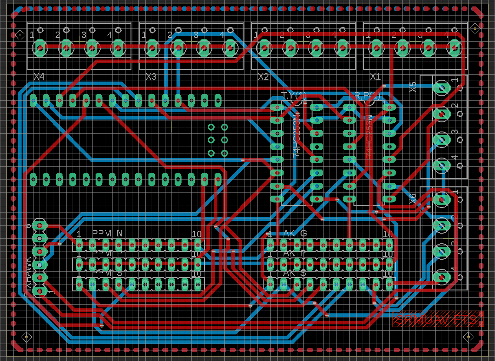
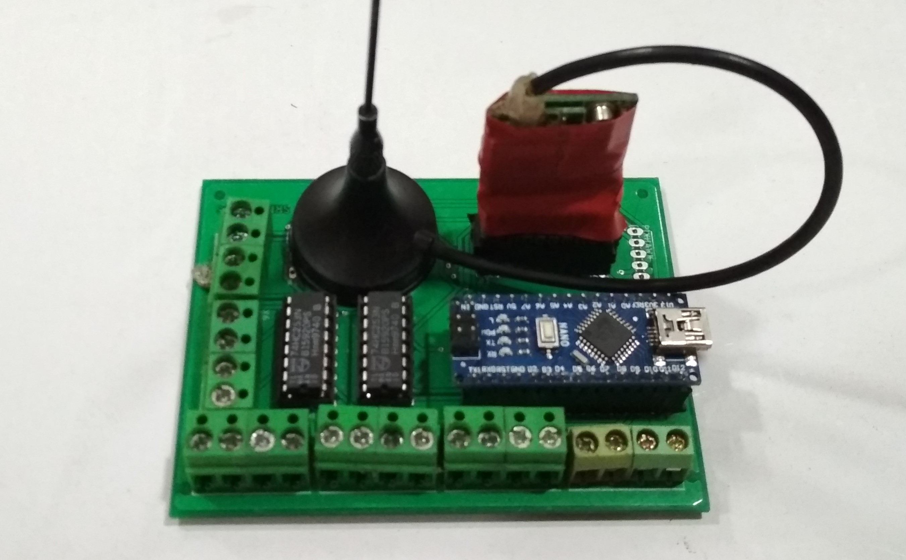

# FTS
Flight Termination System for SUAS 2018

This is the onboard flight termination system designed for the safety flight termination of an aircraft in the case of a telemetry or rc link loss. This system was used by my team SRMUAV's aircraft in the competition AUVSI SUAS 2018. Completely designed in Eagle CAD.

